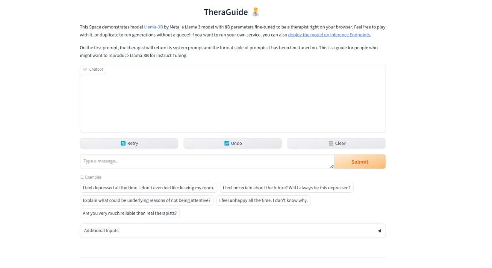

# TheraGuide - Llama-3B Instruction Tuned Therapy ChatBot

## Introduction
Introducing a Multi-Stage Chat Instruct Model as a Therapy Assistant right at your browser.   The model is capable of generating responses closest to your therapist. It is built on `DistilBert` and `Llama-3B` and deployed on `HuggingFace Spaces`.   

The chatbot implementation is reproduced using the LIMA approach [Less is more Alignment](https://arxiv.org/abs/2305.11206). The training process of DistilBert and Llama-3B curates specific and complex structures of prompts and queries.  

The experimentation was to produce an instruction-tuned chatbot curated from a complex conversational tool, "Therapy," which produced strong results, complying with the paper's findings:
`The reasoning, natural language understanding and most of the knowledge of the Large Language Model is learned during the pretraining process and only a finite number of instruction-paired samples are needed to fine-tune it on downstream tasks.` 

## Requirements
- Transformers
- Gradio
- Parameter Efficient Fine-Tuning (PEFT)
- Transformers Reinforcement Learning (TRL)
- BitsAndBytesConfig
- Accelerate
- Torch
- NLTK

You can find more information in `requirements.txt`
